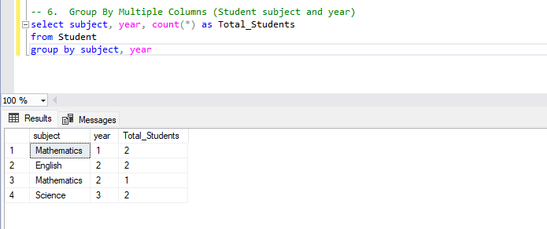
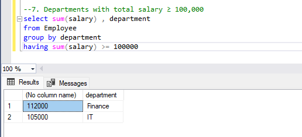
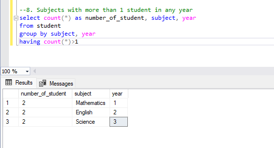

# Aggregate Functions Tasks
### 1. Count the Total Number of Employees
```
SELECT COUNT(*) AS Total_Employees 
from Employee

```
output:


### 2.  Calculate the Total Salary (ignoring NULL values) 
```
select sum(salary) as Total_salary
from Employee

```
Output:


### 3. Find the Average Salary
```
select avg(salary) as Average_Salary
from Employee
```
Output:


### 4. Find the Highest and Lowest Salary
```
select max(salary) as Highest_Salary, min(salary) as Lowest_Salary
from Employee
```

Output:


# GROUP BY 
### 1.  Group By Single Column (Employee name with total salary)
```
select sum(salary), name
from Employee
group by name
```

Output:


### 2.  Group By Multiple Columns (Student subject and year)
```
select subject, year, count(*) as Total_Students
from Student
group by subject, year

``` 
Output:


# HAVING
### 1.  Departments with total salary ≥ 100,000
```
select sum(salary) , department
from Employee
group by department
having sum(salary) >= 100000

``` 
Output:


### 2. Subjects with more than 1 student in any year
```
select count(*) as number_of_student, subject, year
from student 
group by subject, year
having count(*)>1
```
Output:



