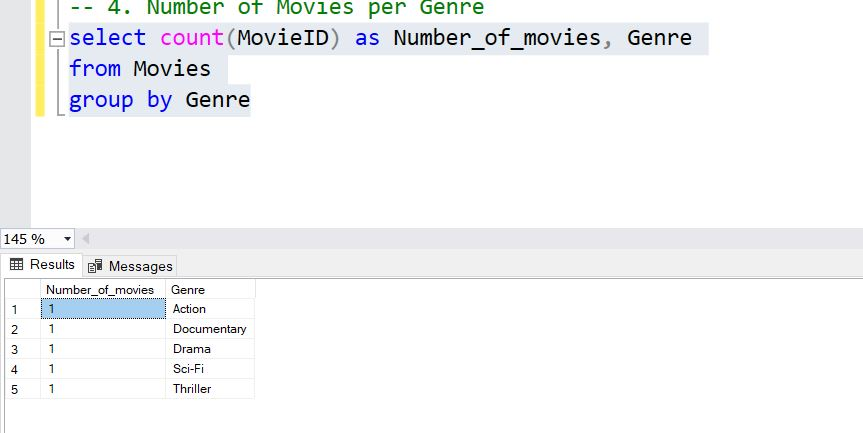
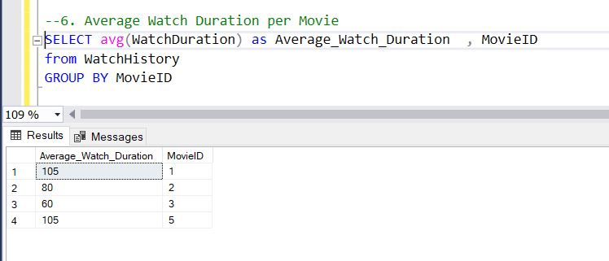

# Real-Life Use Case: Movie Streaming Platform Analytics

The company wants to track user engagement, movie popularity, watch time, and 
subscription statistics to improve platform performance and personalize user 
recommendations. 
➢ You must use this exact structure to create the tables, insert the sample 
data, and then apply the aggregation queries listed for Beginner, 
Intermediate, and Advanced levels.

## * Beginner Level (Basic Practice) 
1. Total Number of Users 
2. Average Duration of All Movies 
3. Total Watch Time 
4. Number of Movies per Genre 
5. Earliest User Join Date 
6. Latest Movie Release Year 

## 1 . Total Number of Users
```
select count(*) as Total_num_users from Users

```

Output:

## 2. Average Duration of All Movies 
```
SELECT AVG(WatchDuration) as Average_WatchDuration from WatchHistory

```
Output:


## 3. Total Watch Time 
```
SELECT sum(WatchDuration) as Total_WatchTime from WatchHistory
```

Output


## 4. Number of Movies per Genre
```
select count(MovieID) as Number_of_movies, Genre
from Movies
group by Genre

```
Output


## 5. Earliest User Join Date 
```
select Min(JoinDate) as EarliestUserJoinDate from Users

```
Output


## 6. Latest Movie Release Year 
```
select Max(ReleaseYear) as LatestMovieReleaseYear  from Movies

```
Output


## Intermediate Level (Deeper Insights) 
4. Number of Users Per Subscription Type 
5. Total Watch Time per User 
6. Average Watch Duration per Movie 
7. Average Watch Time per Subscription Type 
8. Number of Views per Movie (Including Zero) 
9. Average Movie Duration per Release Year


### 4. Number of Users Per Subscription Type
```
select count(UserID) as Number_of_Users, SubscriptionType
from Users
group by SubscriptionType

```
Output:


### 5. Total Watch Time per User 
```
SELECT sum(WatchDuration) as Total_Watch_Time  , UserID 
from WatchHistory
GROUP BY UserID

```
Output:


### 6. Average Watch Duration per Movie
```
SELECT avg(WatchDuration) as Average_Watch_Duration  , MovieID 
from WatchHistory
GROUP BY MovieID
```
Output:


### 7. Average Watch Time per Subscription Type 
```
SELECT avg(WH.WatchDuration) as Average_Watch_Duration , Users.SubscriptionType
from WatchHistory WH join Users 
on Users.UserID = WH.UserID
group by Users.SubscriptionType

```
Output:


### 8. Number of Views per Movie (Including Zero) 
```
select count(UserID) as number_of_views , MovieID
from WatchHistory
group by MovieID

```

Output:


### 9. Average Movie Duration per Release Year
```
SELECT avg(WH.WatchDuration) as Average_Watch_Duration , Movies.ReleaseYear
from WatchHistory WH join Movies 
on Movies.MovieID = WH.MovieID
group by  Movies.ReleaseYear

```
Output:


