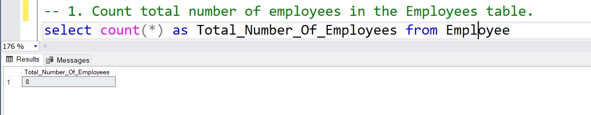
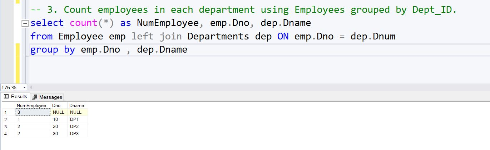
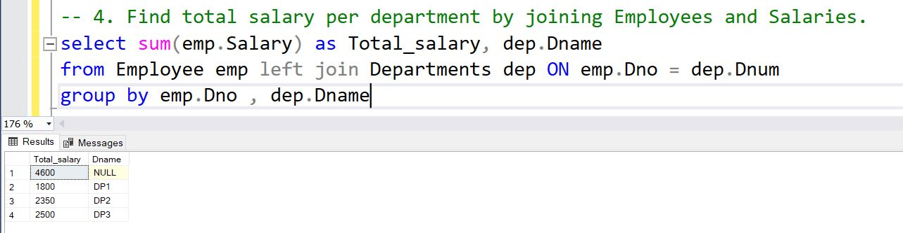
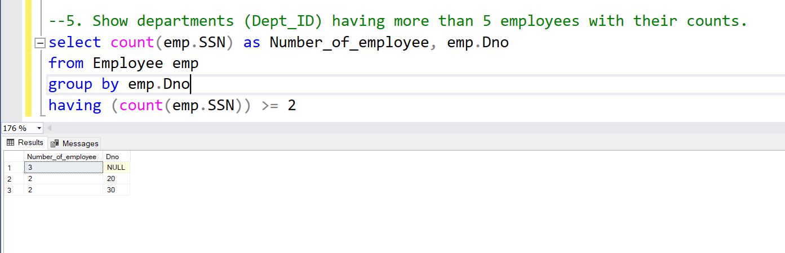

# Aggregation Functions with different database
## Company Database 
#### 1. Count total number of employees in the Employees table. 
```
select count(*) as Total_Number_Of_Employees from Employee
```
OutPut:

#### 2. Calculate average salary from the Salaries table. 
```
select AVG(salary) as Average_Salary from Employee
```
OutPut:


#### 3. Count employees in each department using Employees grouped by Dept_ID. 
```
select count(*) as NumEmployee, emp.Dno, dep.Dname
from Employee emp left join Departments dep ON emp.Dno = dep.Dnum
group by emp.Dno , dep.Dname

```
output: 



#### 4. Find total salary per department by joining Employees and Salaries.
```
select sum(emp.Salary) as Total_salary, dep.Dname
from Employee emp left join Departments dep ON emp.Dno = dep.Dnum
group by emp.Dno , dep.Dname
```
Output:



#### 5. Show departments (Dept_ID) having more than 5 employees with their counts.
```
select count(emp.SSN) as Number_of_employee, emp.Dno
from Employee emp
group by emp.Dno
having (count(emp.SSN)) >= 2
```

Output:



