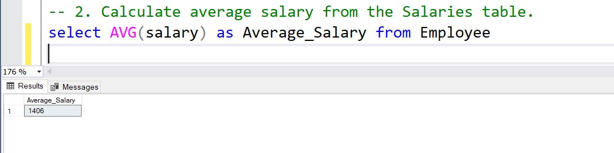

# Aggregation Functions with different database
## Company Database 
#### 1. Count total number of employees in the Employees table. 
```
select count(*) as Total_Number_Of_Employees from Employee
```
OutPut:

#### 2. Calculate average salary from the Salaries table. 
```
select AVG(salary) as Average_Salary from Employee
```
OutPut:


#### 3. Count employees in each department using Employees grouped by Dept_ID. 
```
select count(*) as NumEmployee, emp.Dno, dep.Dname
from Employee emp left join Departments dep ON emp.Dno = dep.Dnum
group by emp.Dno , dep.Dname

```
output: 


#### 4. Find total salary per department by joining Employees and Salaries.
```
select sum(emp.Salary) as Total_salary, dep.Dname
from Employee emp left join Departments dep ON emp.Dno = dep.Dnum
group by emp.Dno , dep.Dname
```
Output:


#### 5. Show departments (Dept_ID) having more than 5 employees with their counts.
```
select count(emp.SSN) as Number_of_employee, emp.Dno
from Employee emp
group by emp.Dno
having (count(emp.SSN)) >= 2
```

Output:


## Airpline Database 
#### 1.  Count total flights in FLIGHT table.
```
select count(*) as total_of_flight from flight

```
output:


#### 2.  Average available seats per leg using FLIGHT_LEG table. 
```
SELECT 
    fl.let_no,
    AVG(at.max_seat - ISNULL(s.used_seats, 0)) AS avg_available_seats
FROM 
    flight_leg fl
JOIN 
    leg_instance li ON fl.let_no = li.let_no
JOIN 
    airplane a ON li.airplane_id = a.airplane_id
JOIN 
    airplane_type at ON a.type_name = at.type_name
LEFT JOIN (
    SELECT 
        date0,
        let_no,
        airplane_id,
        COUNT(*) AS used_seats
    FROM 
        seat
    GROUP BY 
        date0, let_no, airplane_id
) s ON s.date0 = li.date0 AND s.let_no = li.let_no AND s.airplane_id = li.airplane_id
GROUP BY 
    fl.let_no;

```
Output:


#### 3. Count flights scheduled per airline from FLIGHT grouped by Airline_ID.
```
select count(fl.secheduled_arr_time) as number_of_flights_scheduled, airplane.airplane_id
from 
	flight_leg fl
JOIN 
    leg_instance li 
ON fl.let_no = li.let_no

join airplane on airplane.airplane_id = li.airplane_id
group by airplane.airplane_id


```

Output:


#### 4. Total payments per leg using LEG_INSTANCE table grouped by Flight_Leg_ID.
```
select sum(fare.amount) as Total_payments, fl.let_no
from 
	flight_leg fl
JOIN 
    flight 
ON flight.number = fl.number
join
	fare
on flight.number = fare.number

group by fl.let_no
```
Output:


#### 5.  List flight legs with total payments > 10000 grouped by Flight_Leg_ID.

```
select sum(fare.amount) as Total_payments, fl.let_no
from 
	flight_leg fl
JOIN 
    flight 
ON flight.number = fl.number
join
	fare
on flight.number = fare.number

group by fl.let_no

having (sum(fare.amount)) >50.00
```

Output:


