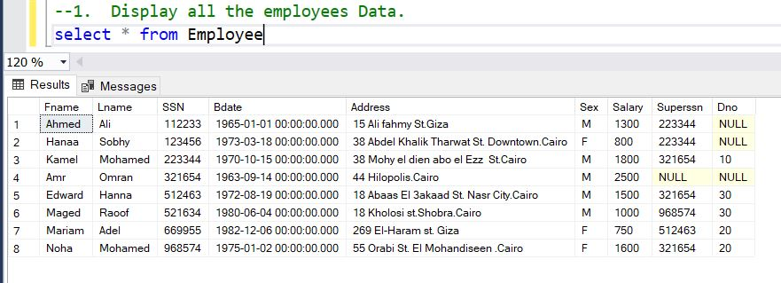
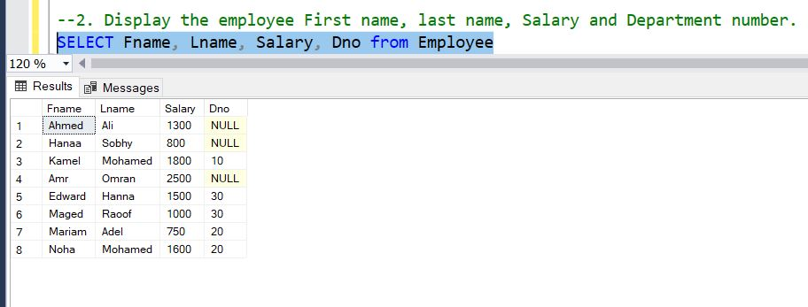
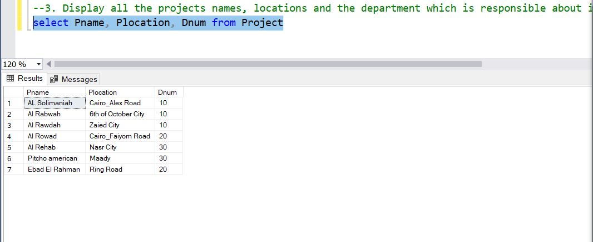
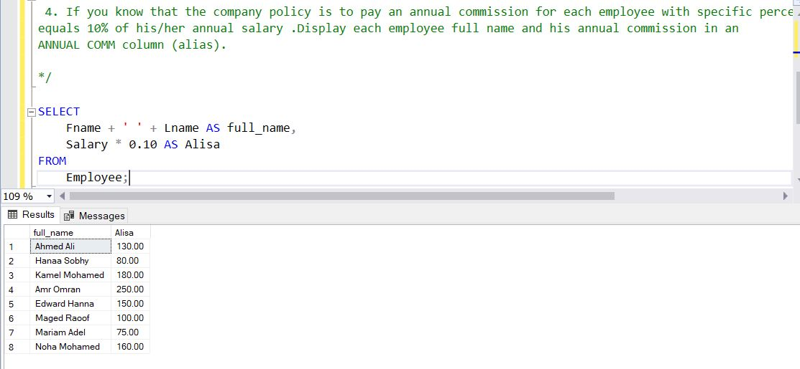
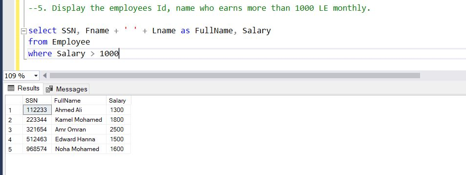
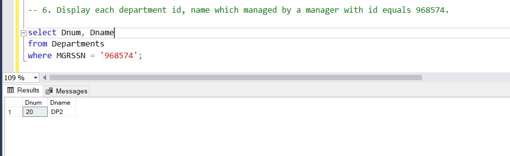
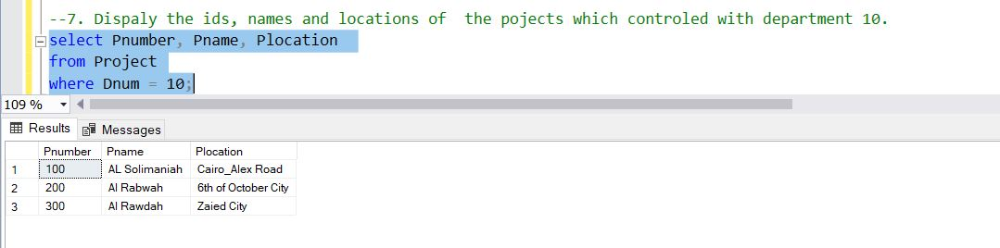
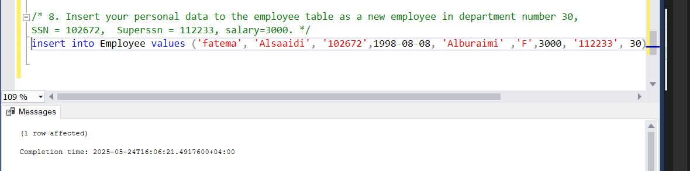
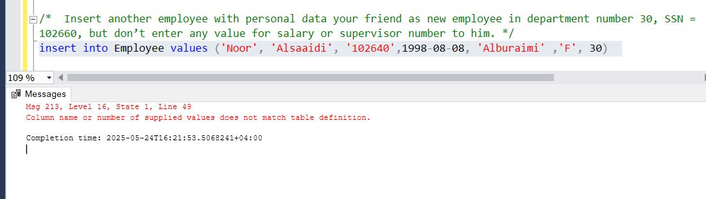
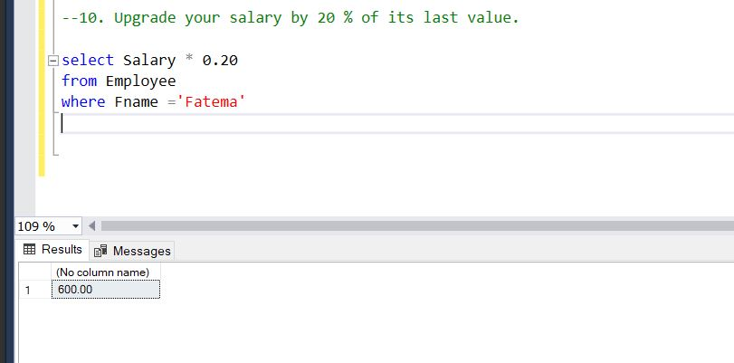

# Task 7 ( DQL and DML)
## Company DB
### 1.  Display all the employees Data.

### 2. Display the employee First name, last name, Salary and Department number. 

### 3. Display all the projects names, locations and the department which is responsible about it. 

### 4.  If you know that the company policy is to pay an annual commission for each employee with specific percent equals 10% of his/her annual salary .Display each employee full name and his annual commission in an ANNUAL COMM column (alias). 

### 5. Display the employees Id, name who earns more than 1000 LE monthly. 

### 6. Display each department id, name which managed by a manager with id equals 968574.

### 7.Dispaly the ids, names and locations of  the pojects which controled with department 10. 

### 8.  Insert your personal data to the employee table as a new employee in department number 30, SSN = 102672, Superssn = 112233, salary=3000. 

### 9.  Insert another employee with personal data your friend as new employee in department number 30, SSN = 
### 102660, but don’t enter any value for salary or supervisor number to him. 

### 10. Upgrade your salary by 20 % of its last value.

