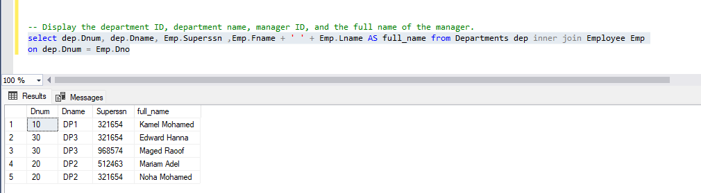

# Company Database – JOIN Queries
### This document contains SQL queries that utilize JOIN operations to retrieve data from the Company database.
#### 1. Display the department ID, department name, manager ID, and the full name of the manager.
```
select dep.Dnum, dep.Dname, Emp.Superssn ,Emp.Fname + ' ' + Emp.Lname AS full_name from Departments dep inner join Employee Emp
on dep.Dnum = Emp.Dno
```
output:
