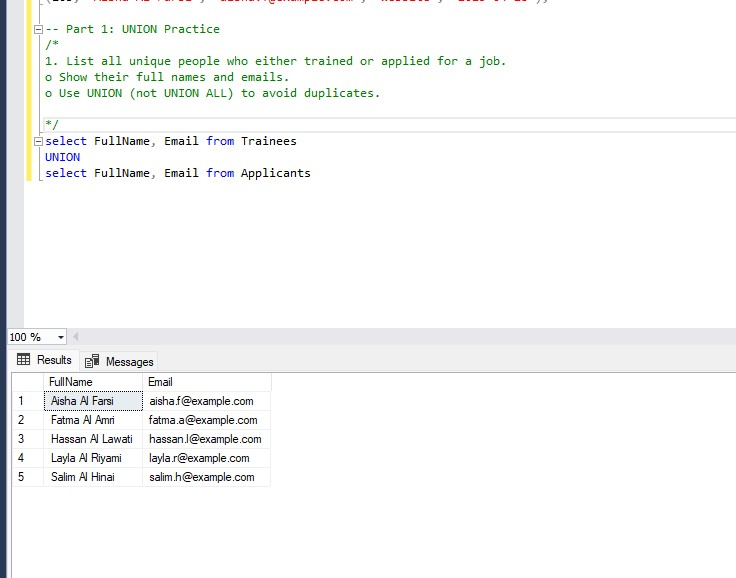
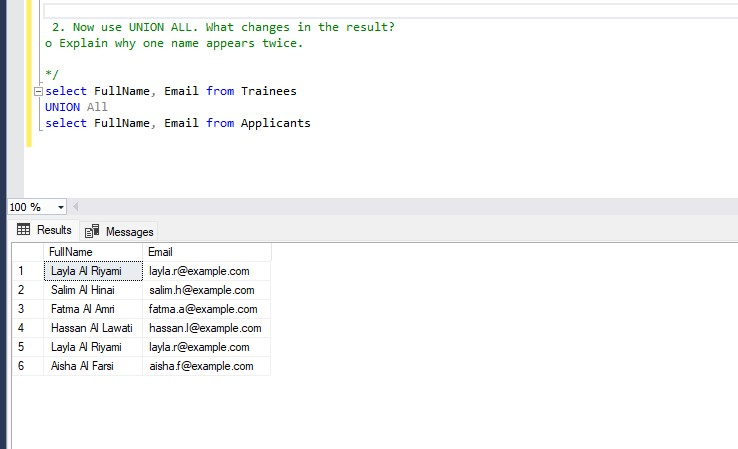
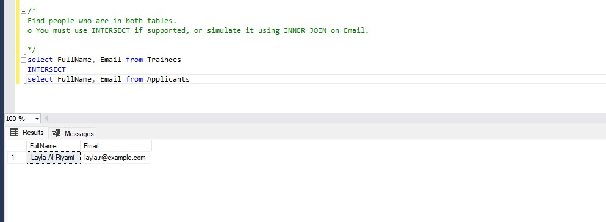

# Practice Scenario: Training & Job Application System 
# Part 1: UNION Practice 
### 1. List all unique people who either trained or applied for a job. 
o Show their full names and emails. 

o Use UNION (not UNION ALL) to avoid duplicates.
```
select FullName, Email from Trainees 
UNION 
select FullName, Email from Applicants 


```


### 2.  Now use UNION ALL. What changes in the result? 
o Explain why one name appears twice. 
because Layla Al Riyami is both a trainee and an applicant, so her name appears in both tables.
```
select FullName, Email from Trainees 
UNION All
select FullName, Email from Applicants 

```


### 3. Find people who are in both tables.

o You must use INTERSECT if supported, or simulate it using INNER JOIN on Email. 

```
select FullName, Email from Trainees 
INTERSECT
select FullName, Email from Applicants 

```


