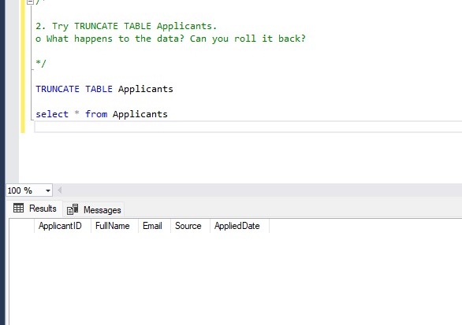
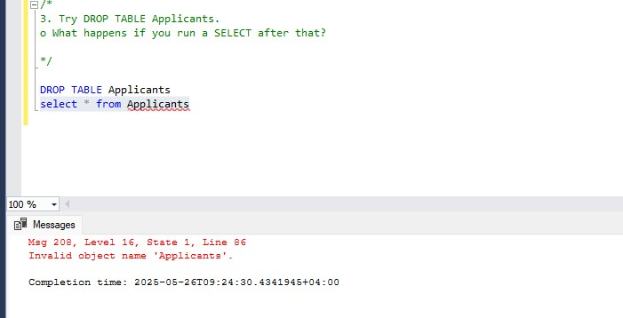

# Part 2: DROP, DELETE, TRUNCATE Observation
#### 1. Try DELETE FROM Trainees WHERE Program = 'Outsystems'. 

o Check if the table structure still exists.
yes the structuire of table is still exist just delete the rows of table row by row 
```
delete from Trainees where Program = 'Outsystems'
select * from Trainees
```


#### 2. Try TRUNCATE TABLE Applicants. 

o What happens to the data? Can you roll it back?
delete the whole rows of table at once not row by row 
```
TRUNCATE TABLE Applicants

select * from Applicants
```



#### 3. Try DROP TABLE Applicants. 

o What happens if you run a SELECT after that? 

delete the rows and structure of table

```
DROP TABLE Applicants

```



