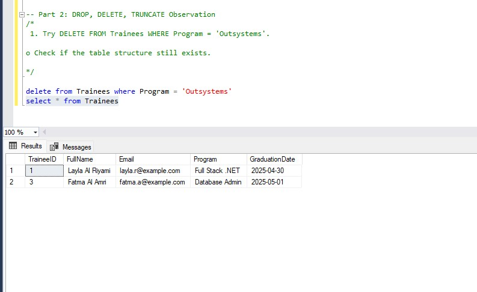

# Part 2: DROP, DELETE, TRUNCATE Observation
#### 1. Try DELETE FROM Trainees WHERE Program = 'Outsystems'. 

o Check if the table structure still exists.
yes the structuire of table is still exist just delete the rows of table row by row 
```
delete from Trainees where Program = 'Outsystems'
select * from Trainees
```


#### 2. Try TRUNCATE TABLE Applicants. 

o What happens to the data? Can you roll it back?
delete the whole rows of table at once not row by row 
```
TRUNCATE TABLE Applicants

select * from Applicants
```


#### 3. Try DROP TABLE Applicants. 

o What happens if you run a SELECT after that? 

delete the rows and structure of table

```
DROP TABLE Applicants

```


## what are the different between delete from table_name, truncate table table_name , drop table table_name 
Here's a clear comparison between DELETE, TRUNCATE, and DROP in SQL Server 

### 1. DELETE FROM table_name

**✅ Description:**

- Removes some or all rows from a table.

- You can use a WHERE clause to filter which rows to delete.

- Can be rolled back if used within a transaction.
```
BEGIN TRANSACTION;

DELETE FROM students;

-- You can undo using:
ROLLBACK;
-- Or apply using:
COMMIT;


```
##### **note:**
###### If the DELETE is executed outside a transaction and committed, you cannot roll it back, unless you have:

###### - A backup of the database.

###### - Point-in-time recovery enabled.
- Does not reset identity column.

- Table structure and schema remain.

**🧪 Example:**
```
-- Delete specific rows
DELETE FROM students WHERE GPA < 2.0;
```

```
-- Delete all rows
DELETE FROM students;
```

### 2. TRUNCATE TABLE table_name
**✅ Description:**

- Removes all rows from a table.

- Faster than DELETE because it deallocates data pages.

- Resets identity column to its seed.

- Cannot delete specific rows (no WHERE clause).

- Can be rolled back if inside a transaction.
```
BEGIN TRANSACTION;
TRUNCATE TABLE students;
-- To undo:
ROLLBACK;
-- To apply:
COMMIT;

```
###### **note:**
###### If it's executed outside a transaction or after a COMMIT, you cannot roll it back.

- Table structure remains.

**🧪 Example:**
```
-- Delete all rows quickly and reset identity
TRUNCATE TABLE students;
```

### 3. DROP TABLE table_name

**✅ Description:**

- Completely removes the table from the database.

- Deletes both data and table structure (columns, constraints, indexes).

- Cannot be rolled back unless you restore from backup.

- After DROP, the table no longer exists.

**🧪 Example:**
```
-- Permanently delete the students table
DROP TABLE students;
```
**🔸 Comparison Table** 

| Feature |	DELETE | TRUNCATE | DROP|
|----|-----|----|----|
|Deletes data only	| ✅ Yes	| ✅ Yes (all rows only)	| ❌ No (deletes structure too)|
|Deletes table structure| 	❌ No| 	❌ No| 	✅ Yes|
|Can use WHERE	| ✅ Yes| 	❌ No| ❌ No| 
|Resets IDENTITY| ❌ No	|✅ Yes	| ✅ Yes (table is gone)|
|Can be rolled back|	✅ Yes|	✅ Yes (if in transaction)|	❌ No|
|Speed (for full clear)| 🟡 Slower| 	🟢 Faster| 	🔴 N/A|


**✅ Summary in Simple Words**

- DELETE: Removes rows (slow, safe, flexible).

- TRUNCATE: Removes all rows (fast, resets IDs, no WHERE).

- DROP: Removes everything (dangerous, table gone).


