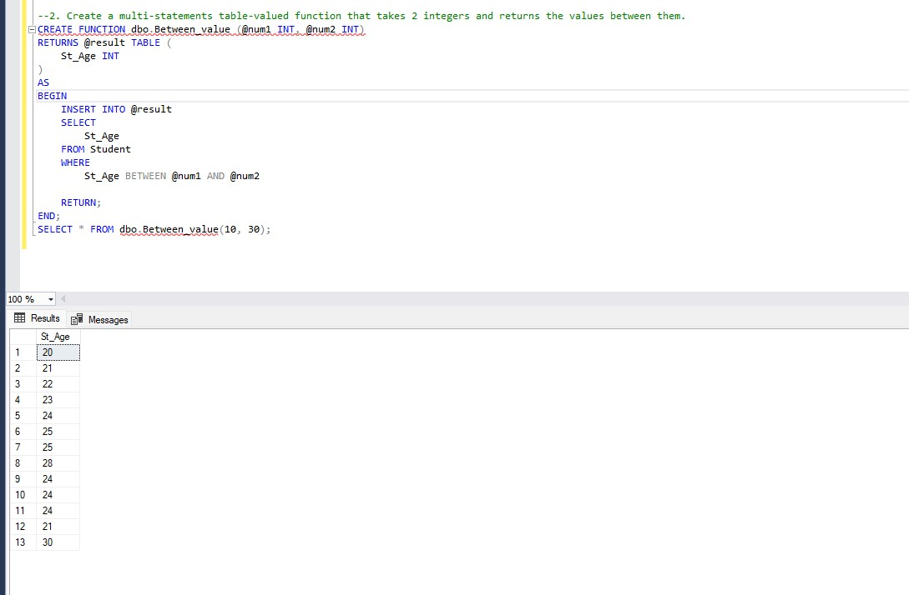

# Functions & Variables & Control of flow statement’s Task
### 1. Create a scalar function that takes date and returns Month name of that date.
```
create function dbo.Month_Name(@date0 as date)
returns varchar(10)
as begin
return datename(MONTH,@date0)

end

SELECT Manager_hiredate, dbo.Month_Name(Manager_hiredate) AS Hire_Month
FROM Department;

```

### 2. Create a multi-statements table-valued function that takes 2 integers and returns the values between them. 
```
CREATE FUNCTION dbo.Between_value (@num1 INT, @num2 INT)
RETURNS @result TABLE (
    St_Age INT
)
AS
BEGIN
    INSERT INTO @result
    SELECT 
        St_Age
    FROM Student
    WHERE 
        St_Age BETWEEN @num1 AND @num2

    RETURN;
END;
SELECT * FROM dbo.Between_value(10, 30);


```

