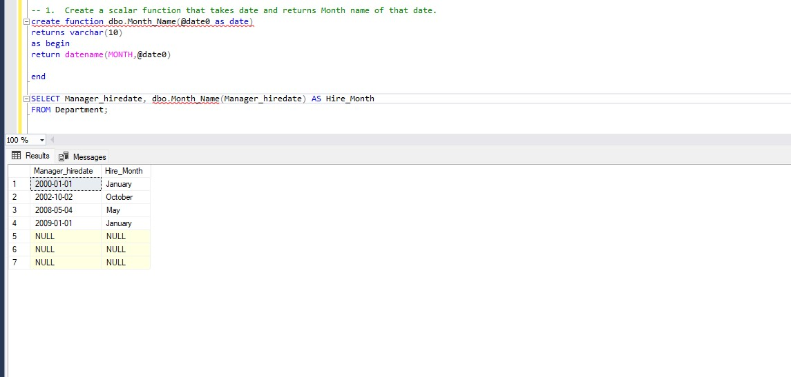

# Functions & Variables & Control of flow statement’s Task
### 1. Create a scalar function that takes date and returns Month name of that date.
```
create function dbo.Month_Name(@date0 as date)
returns varchar(10)
as begin
return datename(MONTH,@date0)

end

SELECT Manager_hiredate, dbo.Month_Name(Manager_hiredate) AS Hire_Month
FROM Department;

```
